# 📊 DIAGRAMAS DE ARQUITECTURA - Sistema RSL

Este documento contiene diagramas visuales de la arquitectura del sistema usando Mermaid.

---

## 1. Arquitectura General (3 Capas SDN)

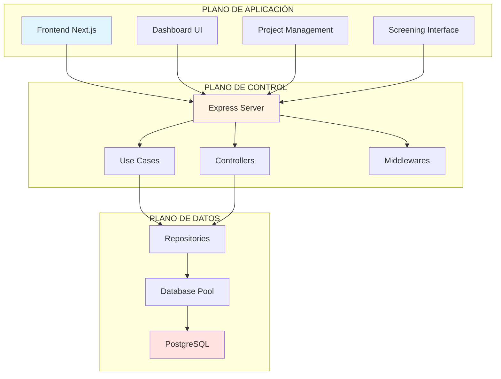

---

## 2. Flujo de Petición HTTP (Request Flow)

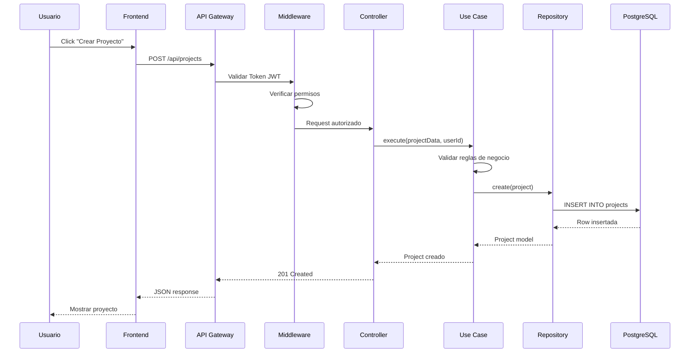

---

## 3. Arquitectura de Capas (Layered Architecture)

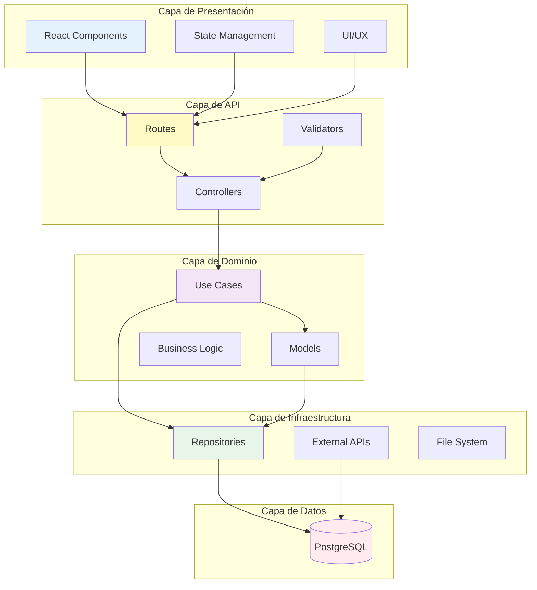

---

## 4. Componentes del Sistema

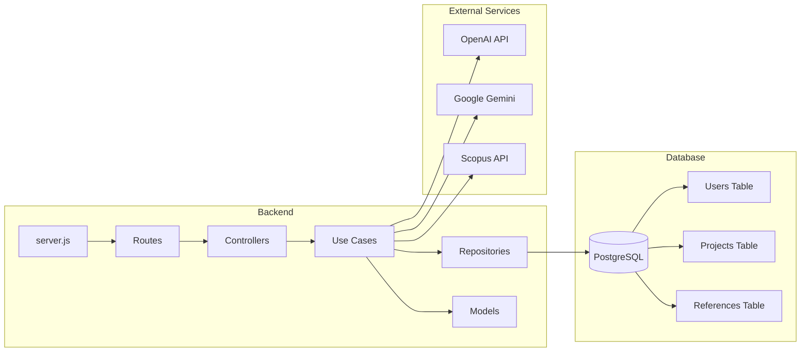

---

## 5. Patrón Repository

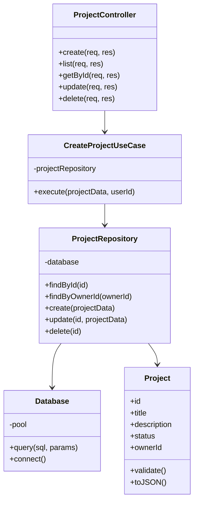

---

## 6. Políticas de Seguridad

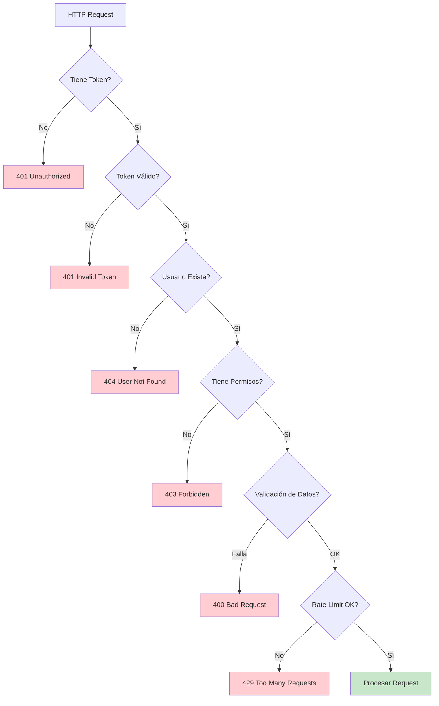

---

## 7. Arquitectura de Despliegue

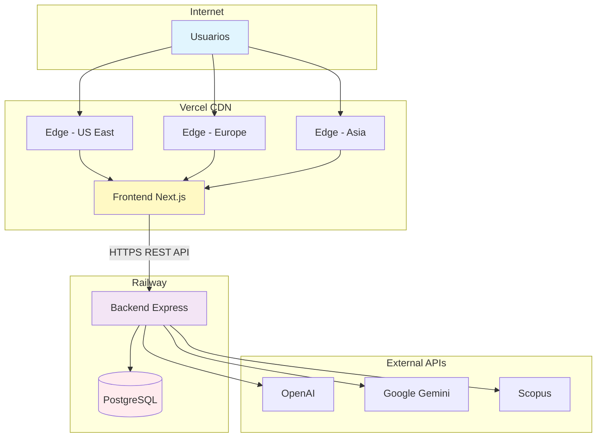

---

## 8. Flujo de Autenticación OAuth

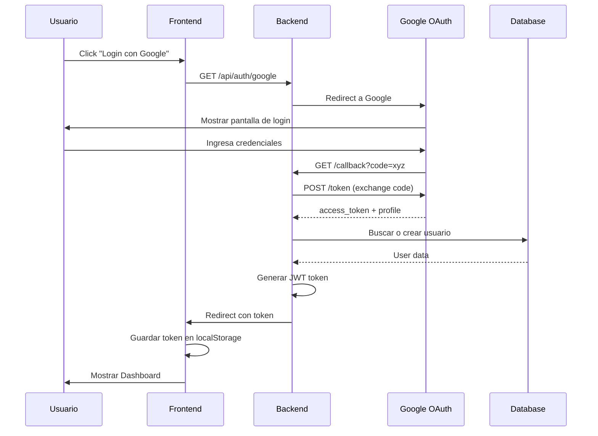

---

## 9. Ciclo de Vida de un Proyecto RSL

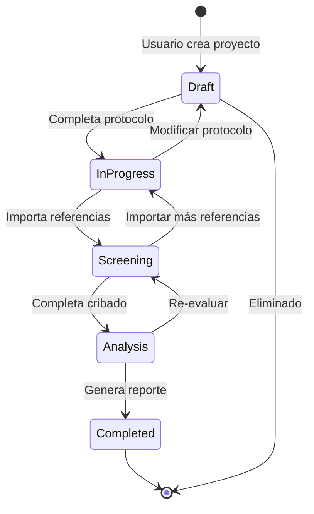

---

## 10. Modelo de Datos (ERD Simplificado)

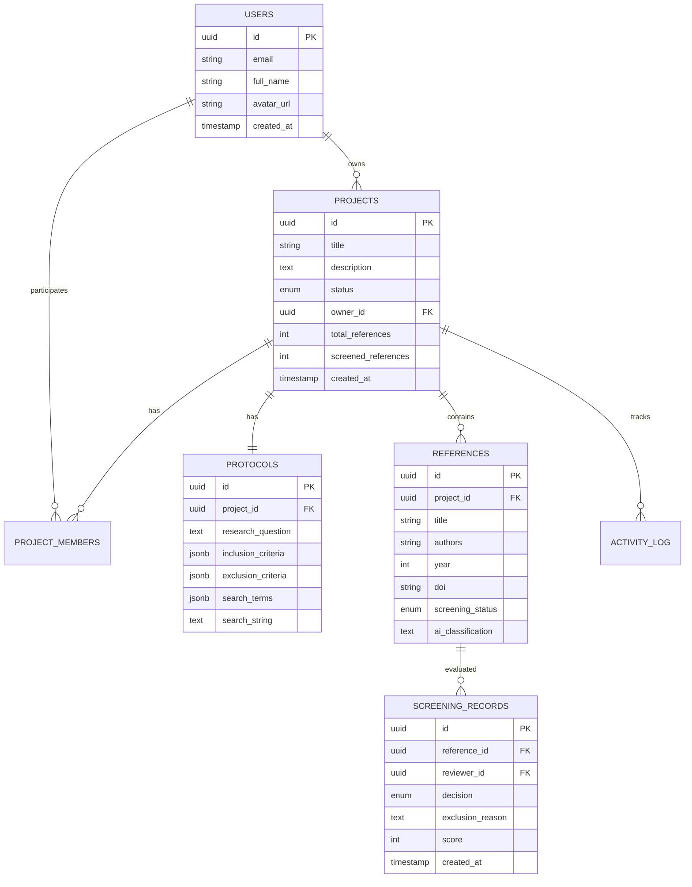

---

## 11. Flujo de Screening Automático (IA)

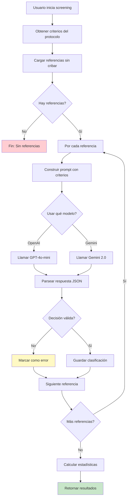

---

## 12. API Endpoints (REST)

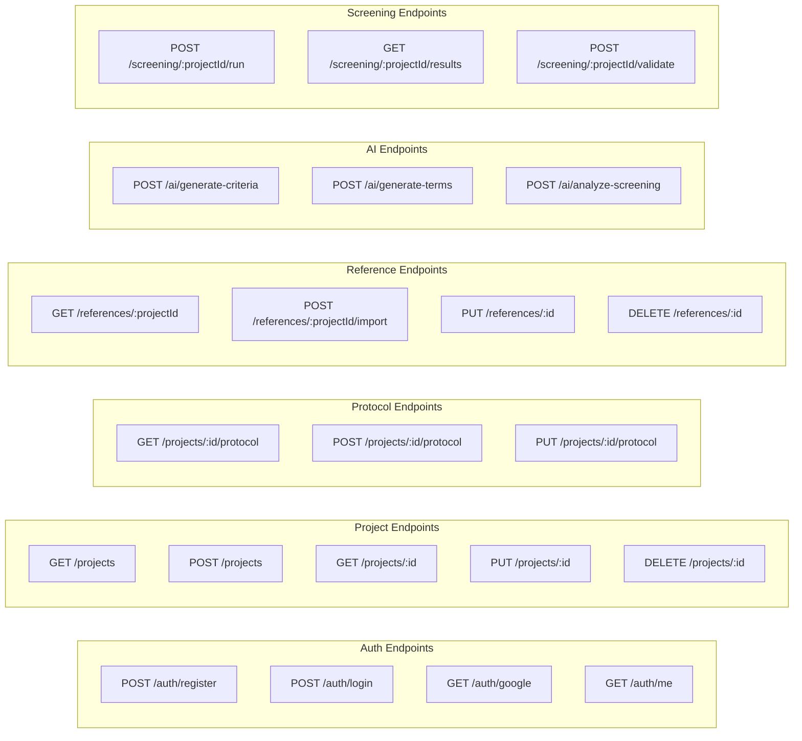

---

## 13. Middleware Pipeline

```mermaid
graph LR
    A[HTTP Request] --> B[CORS Middleware]
    B --> C[Body Parser]
    C --> D[BSON Middleware]
    D --> E[Logger Middleware]
    E --> F[Auth Middleware]
    F --> G[Validation Middleware]
    G --> H[Rate Limiter]
    H --> I[Router]
    I --> J[Controller]
    J --> K[Use Case]
    K --> L[Response]
    
    style A fill:#e1f5fe
    style L fill:#c8e6c9
```

---

## 14. Arquitectura de Microservicios (Conceptual)

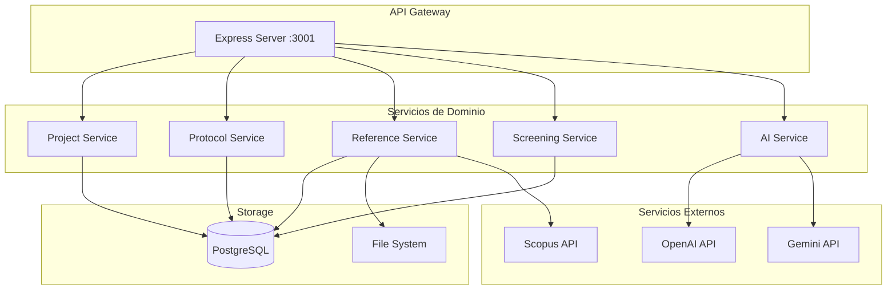

---

## 15. Comparación SDN vs Sistema RSL

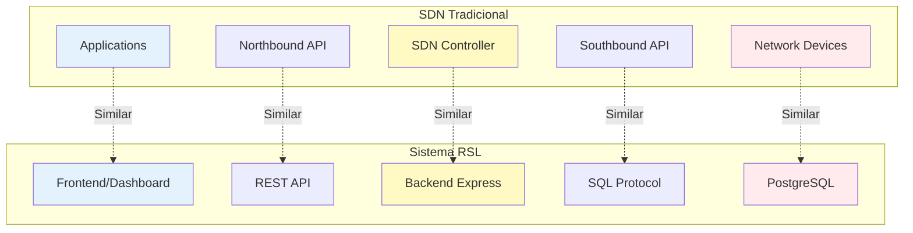

---

## 16. Proceso de CI/CD

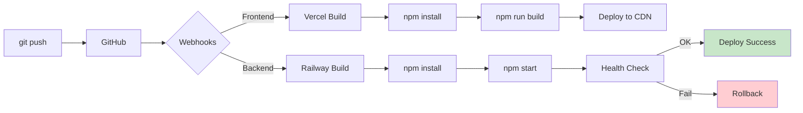

---

## 17. Sistema de Caché (Futuro)

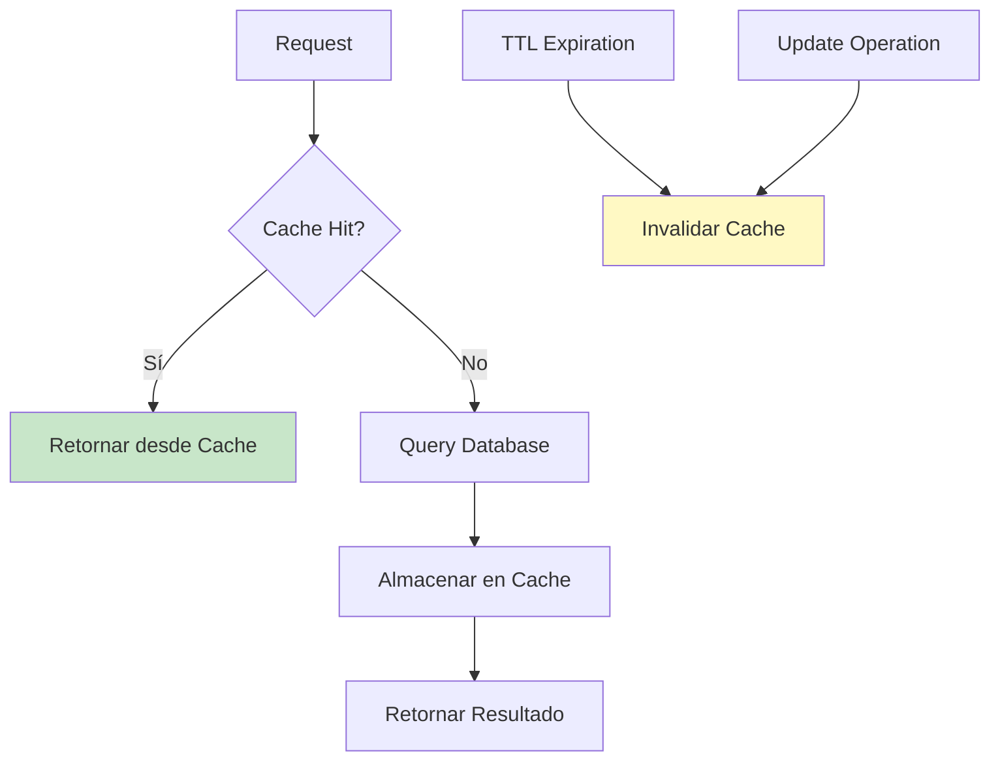

---

## 18. Monitoreo y Logging

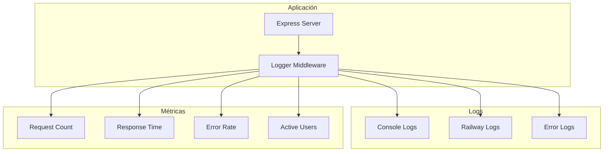

---

## 19. Gestión de Errores

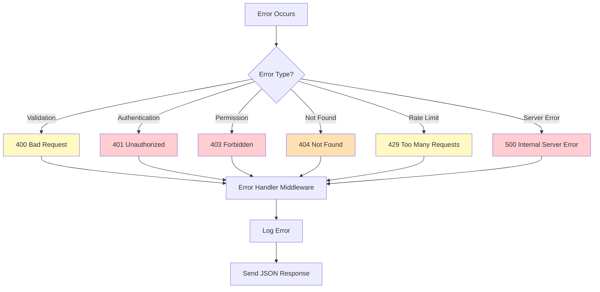

---

## 20. Modelo de Negocio (Use Cases)

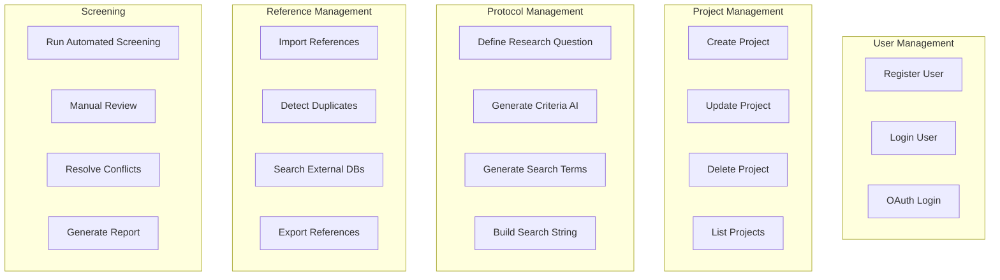

---

*Todos los diagramas están en formato Mermaid y son renderizables en GitHub, VS Code, y herramientas compatibles*
