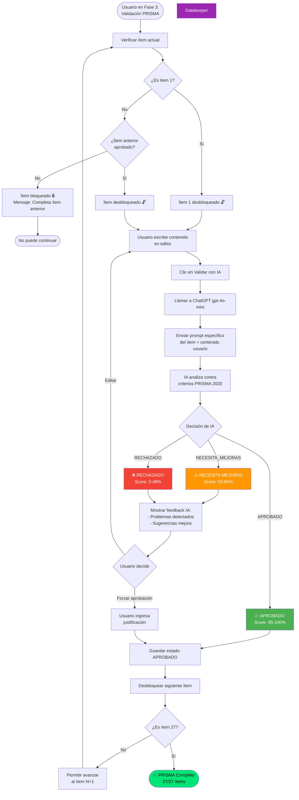
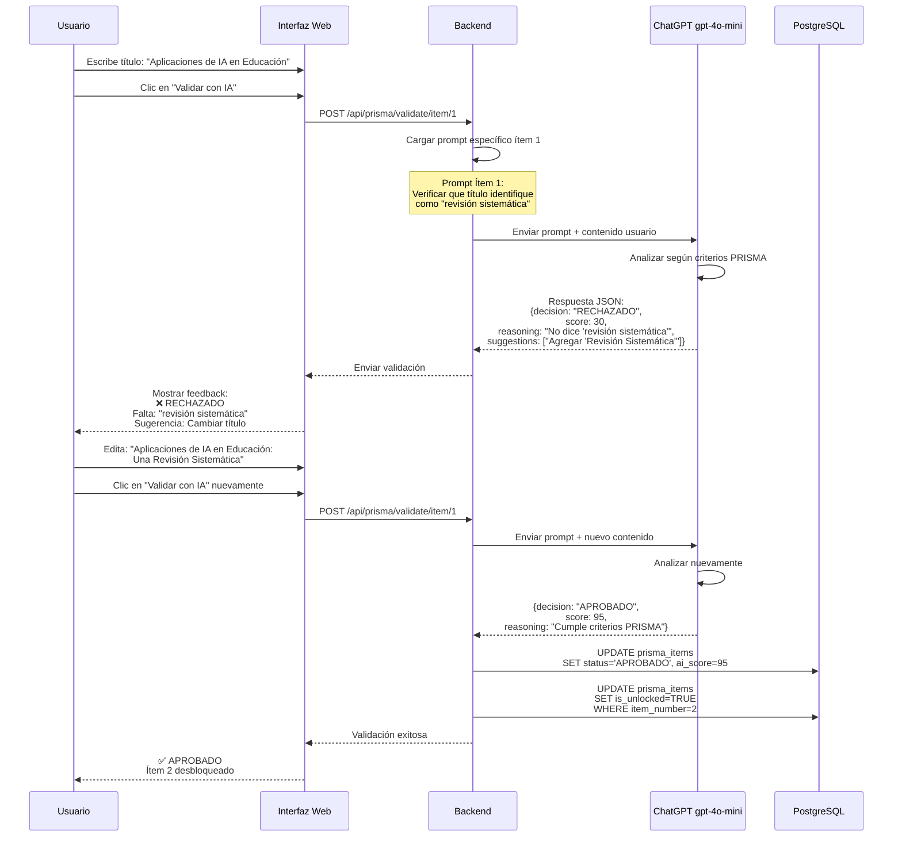
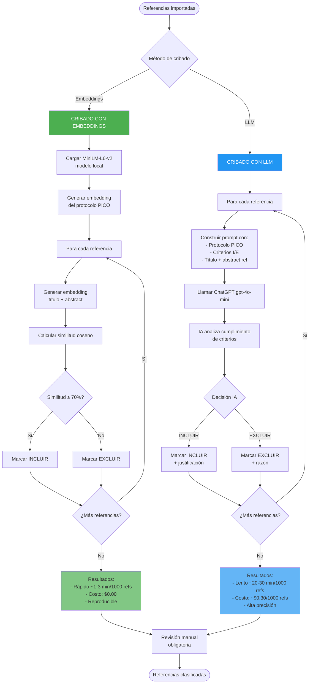
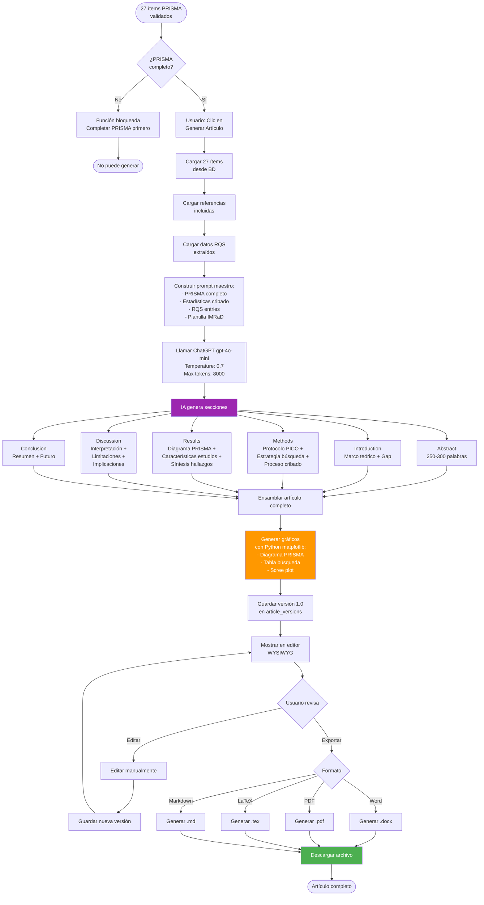
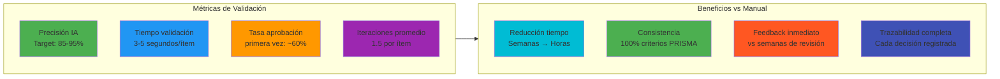
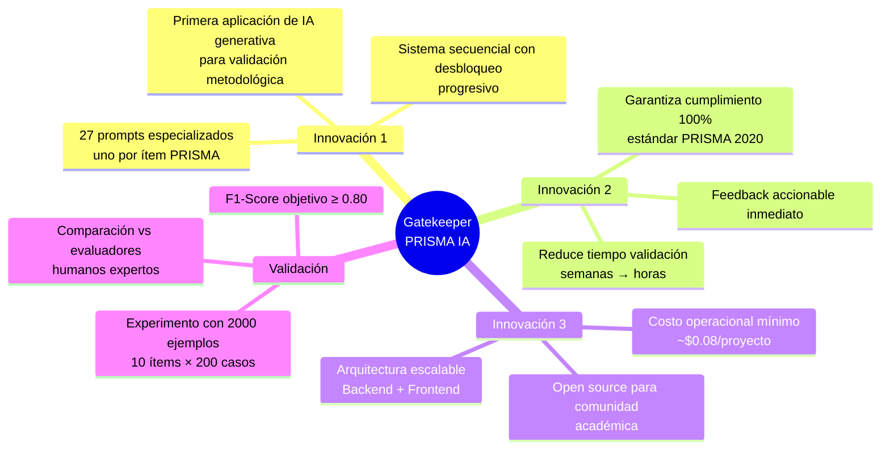

# FLUJOGRAMAS DEL SISTEMA RSL CON GATEKEEPER IA

**Fecha**: Enero 25, 2026  
**Autores**: Stefanny Mishel Hernández Buenaño, Adriana Pamela González Orellana  
**Tutor**: Ing. Paulo César Galarza Sánchez, MSc.  
**Institución**: Universidad de las Fuerzas Armadas ESPE

---

## 📋 ÍNDICE

1. [Flujo General del Sistema](#1-flujo-general-del-sistema)
2. [Flujo del Gatekeeper PRISMA](#2-flujo-del-gatekeeper-prisma-innovación-principal)
3. [Flujo de Cribado con IA](#3-flujo-de-cribado-con-ia)
4. [Flujo de Generación de Artículo](#4-flujo-de-generación-de-artículo)

---

## 1. FLUJO GENERAL DEL SISTEMA

### Diagrama de Flujo Completo

```mermaid
flowchart TD
    Start([Usuario inicia sesión]) --> CreateProject[Crear Proyecto]
    CreateProject --> Phase1[FASE 1: Protocolo PICO]
    
    Phase1 --> InputQuestion[Ingresar pregunta de investigación]
    InputQuestion --> PICO[IA genera análisis PICO]
    PICO --> Terms[IA genera términos del protocolo]
    Terms --> Criteria[IA genera criterios inclusión/exclusión]
    Criteria --> SearchStrings[IA genera cadenas de búsqueda]
    SearchStrings --> ProtocolComplete{¿Protocolo completo?}
    
    ProtocolComplete -->|No| InputQuestion
    ProtocolComplete -->|Sí| Phase2[FASE 2: Búsqueda y Cribado]
    
    Phase2 --> Import[Importar referencias<br/>BibTeX, RIS, CSV]
    Import --> Duplicates[Detección automática<br/>de duplicados]
    Duplicates --> Screen[Cribado con IA]
    
    Screen --> ScreenMethod{Método de cribado}
    ScreenMethod -->|Embeddings| EmbedScreen[Cribado con MiniLM-L6-v2<br/>Similitud semántica]
    ScreenMethod -->|LLM| LLMScreen[Cribado con ChatGPT<br/>Análisis contextual]
    
    EmbedScreen --> ManualReview[Revisión manual]
    LLMScreen --> ManualReview
    ManualReview --> PRISMADiagram[Generar diagrama PRISMA]
    PRISMADiagram --> Phase3[FASE 3: Validación PRISMA]
    
    Phase3 --> Gatekeeper[Gatekeeper IA<br/>27 ítems PRISMA]
    Gatekeeper --> AllValidated{¿27/27 ítems<br/>validados?}
    
    AllValidated -->|No| Gatekeeper
    AllValidated -->|Sí| Phase4[FASE 4: Artículo]
    
    Phase4 --> GenArticle[IA genera borrador<br/>desde PRISMA]
    GenArticle --> Review[Revisar y editar]
    Review --> Export[Exportar<br/>Word, PDF, LaTeX]
    Export --> End([Artículo completo])
    
    style Phase1 fill:#e3f2fd
    style Phase2 fill:#fff3e0
    style Phase3 fill:#f3e5f5
    style Phase4 fill:#e8f5e9
    style Gatekeeper fill:#ff9800,stroke:#e65100,stroke-width:3px
```



---

## 2. FLUJO DEL GATEKEEPER PRISMA (Innovación Principal)

### Diagrama Detallado del Gatekeeper



### Ejemplo Concreto del Gatekeeper



---

## 3. FLUJO DE CRIBADO CON IA

### Comparación de Métodos



---

## 4. FLUJO DE GENERACIÓN DE ARTÍCULO

### De PRISMA a Artículo Científico



---

## 5. ARQUITECTURA DEL GATEKEEPER

### Componentes del Sistema

```mermaid
graph TB
    subgraph Frontend["Frontend (Next.js 14 + React 19)"]
        UI[Interfaz de Usuario<br/>Editor PRISMA]
        ValidateBtn[Botón: Validar con IA]
        Feedback[Panel de Feedback]
    end
    
    subgraph Backend["Backend (Node.js 20 + Express 4.18)"]
        API[API REST<br/>POST /api/prisma/validate]
        Controller[PRISMA Controller<br/>validateWithAI()]
        Prompts[27 Prompts<br/>prisma-validation-prompts.js]
    end
    
    subgraph AI["Servicios IA"]
        ChatGPT[ChatGPT gpt-4o-mini<br/>OpenAI API]
        Embeddings[MiniLM-L6-v2<br/>Local @xenova/transformers]
    end
    
    subgraph Database["Base de Datos (PostgreSQL 15)"]
        PrismaTable[(Tabla: prisma_items<br/>- item_number<br/>- content<br/>- status<br/>- ai_score<br/>- is_unlocked)]
    end
    
    UI --> ValidateBtn
    ValidateBtn --> API
    API --> Controller
    Controller --> Prompts
    Prompts --> ChatGPT
    ChatGPT --> Controller
    Controller --> PrismaTable
    PrismaTable --> Controller
    Controller --> API
    API --> Feedback
    Feedback --> UI
    
    style ChatGPT fill:#00a67e,color:#fff
    style Prompts fill:#ff6b6b,color:#fff
    style PrismaTable fill:#4dabf7,color:#fff
```

---

## 6. MÉTRICAS Y ESTADÍSTICAS

### KPIs del Gatekeeper



---

## 7. INNOVACIÓN CIENTÍFICA

### Contribución de la Tesis



---

## 📝 NOTAS PARA LA REVISORA

### Puntos Clave a Destacar

1. **Gatekeeper es la innovación central**: Sistema automatizado de validación PRISMA nunca antes implementado con IA generativa.

2. **Desbloqueo secuencial garantiza calidad**: No se puede avanzar sin aprobar cada ítem, forzando cumplimiento metodológico riguroso.

3. **Feedback explicativo**: La IA no solo rechaza, sino que explica QUÉ falta y CÓMO corregirlo.

4. **Validación experimental**: Se incluye experimento científico (Anexo C) con 2,000 ejemplos para medir precisión vs humanos.

5. **Costo accesible**: Solo ~$0.08 por proyecto usando ChatGPT gpt-4o-mini + embeddings locales gratuitos.

6. **Impacto**: Reduce tiempo de validación PRISMA de semanas a horas, democratizando RSL de calidad.

---

## 🎓 CONCLUSIÓN

Este sistema representa la **primera implementación documentada** de un gatekeeper de IA para validación automatizada de revisiones sistemáticas siguiendo el estándar PRISMA 2020.

La combinación de:
- ✅ Validación secuencial obligatoria
- ✅ Feedback inmediato y accionable  
- ✅ 27 prompts especializados
- ✅ Arquitectura web escalable
- ✅ Bajo costo operacional

Constituye una **contribución científica significativa** al área de metodología de investigación y sistemas de información.

---

**Elaborado por**:  
Stefanny Mishel Hernández Buenaño - smhernandez2@espe.edu.ec  
Adriana Pamela González Orellana - apgonzales1@espe.edu.ec

**Tutor**:  
Ing. Paulo César Galarza Sánchez, MSc. - pcgalarza@espe.edu.ec

**Universidad de las Fuerzas Armadas ESPE**  
Departamento de Ciencias de la Computación  
Enero 25, 2026
