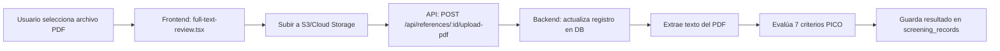

```mermaid
graph LR
    A[Usuario selecciona archivo CSV/RIS] --> B[Frontend: import-references-button.tsx]
    B --> C[API: POST /api/projects/:id/references/import]
    C --> D[Backend: parse-bibliography-file.js]
    D --> E[Validación y normalización de campos]
    E --> F[Detección de duplicados por DOI/título]
    F --> G[Inserción en tabla 'references']
    G --> H[Respuesta: imported count]
```

# 🔍 Aclaración: Dos Mecanismos de Importación Distintos

## 📌 Resumen Ejecutivo

El sistema tiene **DOS botones de importación completamente diferentes** que aparecen en distintas fases del proceso:

| Característica | 🗂️ **Importar Referencias** | 📄 **Cargar PDF** |
|----------------|------------------------------|-------------------|
| **Ubicación** | Protocol Wizard → Paso 6 (Plan de Búsqueda) | Screening → Página de cribado |
| **Fase PRISMA** | Item 6: Proceso de Selección (Importación inicial) | Item 17: Full Text Screening |
| **Formato** | CSV, RIS, BibTeX (metadatos bibliográficos) | PDF (artículo completo) |
| **Cantidad** | Múltiples referencias a la vez (batch) | Un PDF por referencia |
| **Objetivo** | Poblar base de datos con referencias para cribar | Adjuntar texto completo para evaluación detallada |
| **API Endpoint** | `POST /api/projects/:id/references/import` | `POST /api/references/:id/upload-pdf` |
| **Tabla DB** | `references` (crea nuevos registros) | `references` (actualiza `pdf_url` de registro existente) |
| **Cuándo usar** | Al inicio, después de buscar en bases de datos | Después de Phase 1 y 2, solo para artículos pre-seleccionados |

---

## 1. 🗂️ Botón: "Importar Referencias" (CSV/RIS/BibTeX)

### 📍 ¿Dónde Aparece?

**Protocol Wizard → Paso 6: Plan de Búsqueda**

```typescript
// Archivo: frontend/components/project-wizard/steps/6-search-plan-step.tsx
<ImportReferencesButton
  projectId={projectId}
  onImportSuccess={(count) => {
    toast({ title: `${count} referencias importadas exitosamente` })
  }}
/>
```

### 🎯 Propósito

Importar **metadatos bibliográficos** de múltiples referencias obtenidas de bases de datos académicas (PubMed, Scopus, Web of Science, etc.) para iniciar el proceso de screening.

### 📂 Formatos Aceptados

1. **CSV** (valores separados por comas):
   ```csv
   title,authors,year,journal,abstract,doi,keywords
   "Machine Learning in Healthcare",Smith J; Jones M,2023,Nature,This study explores...,10.1038/...,AI;Healthcare
   ```

2. **RIS** (Research Information Systems):
   ```
   TY  - JOUR
   TI  - Machine Learning in Healthcare
   AU  - Smith, John
   AU  - Jones, Mary
   PY  - 2023
   JO  - Nature
   AB  - This study explores...
   DO  - 10.1038/...
   ER  -
   ```

3. **BibTeX** (formato bibliográfico de LaTeX):
   ```bibtex
   @article{smith2023machine,
     title={Machine Learning in Healthcare},
     author={Smith, John and Jones, Mary},
     journal={Nature},
     year={2023},
     doi={10.1038/...}
   }
   ```

### ⚙️ Flujo Técnico



### 🗄️ Impacto en Base de Datos

**Crea nuevos registros** en la tabla `references`:

```sql
INSERT INTO references (
  id,
  project_id,
  title,
  authors,
  year,
  journal,
  abstract,
  doi,
  keywords,
  status,              -- Inicializa en 'pending'
  ai_classification,   -- NULL (aún no evaluado)
  ai_score,            -- NULL
  reviewed_by,         -- NULL
  pdf_url              -- NULL (se agregará después)
) VALUES (...);
```

**Campos inicializados:**
- `status`: `'pending'` (pendiente de screening)
- `ai_classification`: `NULL` (se calcula en Phase 1)
- `ai_score`: `NULL` (se calcula en Phase 1)
- `pdf_url`: `NULL` (se agrega más tarde con el otro botón)

### 📊 Ejemplo de Uso

**Escenario:** El usuario realizó una búsqueda en PubMed con la query:
```
("machine learning" OR "artificial intelligence") AND "systematic review" AND "healthcare"
```

**Resultado:** 350 referencias encontradas

**Proceso:**
1. Exportar resultados de PubMed como archivo RIS
2. Ir al Paso 6 del Protocol Wizard
3. Click en "Importar Referencias"
4. Seleccionar archivo `pubmed_results.ris`
5. Sistema importa 350 referencias → Estado: `pending`
6. Proceder a ejecutar Phase 1 (Embeddings) para priorizar

---

## 2. 📄 Botón: "Cargar PDF" (Artículo Completo)

### 📍 ¿Dónde Aparece?

**Página de Screening → Tabla de Referencias → Columna "Full Text"**

```typescript
// Archivo: frontend/components/screening/full-text-review.tsx
<Button 
  variant="outline" 
  size="sm"
  onClick={() => uploadPdfRef.current?.click()}
>
  <Upload className="h-4 w-4 mr-2" />
  Cargar PDF
</Button>

<input
  ref={uploadPdfRef}
  type="file"
  accept=".pdf"
  onChange={handlePdfUpload}
  hidden
/>
```

### 🎯 Propósito

Adjuntar el **texto completo en PDF** de UN artículo específico para realizar la **evaluación detallada de 7 criterios** (Phase 4: Full Text Screening).

### 📂 Formato Aceptado

Solo **archivos PDF** (`.pdf`)

**Restricciones:**
- Tamaño máximo: 10 MB (configurable)
- Un PDF por referencia
- El PDF debe ser legible (no imágenes escaneadas sin OCR)

### ⚙️ Flujo Técnico



### 🗄️ Impacto en Base de Datos

**Actualiza un registro existente** en la tabla `references`:

```sql
UPDATE references
SET 
  pdf_url = 'https://s3.amazonaws.com/bucket/project-123/reference-456.pdf',
  full_text_extracted = '[Texto completo extraído del PDF]',
  updated_at = NOW()
WHERE id = '456';
```

**Crea un nuevo registro** en la tabla `screening_records`:

```sql
INSERT INTO screening_records (
  id,
  reference_id,
  project_id,
  stage,               -- 'full_text'
  decision,            -- 'pending', luego 'included'/'excluded'
  scores,              -- JSONB con 7 criterios
  evaluated_by,
  evaluated_at
) VALUES (...);
```

### 📊 Ejemplo de Uso

**Escenario:** Después de Phase 1 y 2, el usuario identificó 45 artículos de alta prioridad para revisión de texto completo.

**Proceso:**
1. Ir a la página de Screening
2. Filtrar por `ai_classification = 'high_priority'`
3. Para cada referencia de alta prioridad:
   - Descargar el PDF del artículo (desde DOI o journal)
   - Click en "Cargar PDF" en la columna "Full Text"
   - Seleccionar el archivo PDF descargado
   - Sistema extrae texto y evalúa automáticamente 7 criterios
4. Revisar manualmente los resultados de la evaluación
5. Tomar decisión final: Incluir o Excluir

---

## 🔄 Comparación Visual de Flujos

### Flujo 1: Importar Referencias (Inicio del Screening)

```
┌─────────────────────────────────────────────────────────────┐
│ FASE 1: BÚSQUEDA EN BASES DE DATOS                          │
└─────────────────────────────────────────────────────────────┘
                         ↓
        PubMed / Scopus / Web of Science
                         ↓
              Exportar resultados como CSV/RIS
                         ↓
┌─────────────────────────────────────────────────────────────┐
│ PROTOCOL WIZARD → PASO 6: PLAN DE BÚSQUEDA                  │
│                                                              │
│  [🗂️ Importar Referencias (CSV/RIS/BibTeX)]                │
│                                                              │
│  ✅ Se importaron 350 referencias                           │
└─────────────────────────────────────────────────────────────┘
                         ↓
┌─────────────────────────────────────────────────────────────┐
│ TABLA: references                                            │
│                                                              │
│  350 registros creados:                                      │
│  - title, authors, year, abstract, doi                       │
│  - status: 'pending'                                         │
│  - pdf_url: NULL                                             │
└─────────────────────────────────────────────────────────────┘
                         ↓
              Ejecutar Phase 1 (Embeddings)
                         ↓
              Ejecutar Phase 2 (ChatGPT/Gemini)
                         ↓
           Resultado: 45 artículos de alta prioridad
```

### Flujo 2: Cargar PDF (Full Text Screening)

```
┌─────────────────────────────────────────────────────────────┐
│ PÁGINA DE SCREENING → REFERENCIAS DE ALTA PRIORIDAD         │
│                                                              │
│  Referencia #23:                                             │
│  "Machine Learning for Medical Diagnosis"                    │
│  Smith et al., 2023 | Nature Medicine                        │
│                                                              │
│  [📄 Cargar PDF del artículo completo]                      │
└─────────────────────────────────────────────────────────────┘
                         ↓
        Usuario descarga PDF desde journal website
                         ↓
┌─────────────────────────────────────────────────────────────┐
│ DIALOG: FULL TEXT EVALUATION                                 │
│                                                              │
│  📎 Archivo: smith2023_machine_learning.pdf (2.3 MB)        │
│                                                              │
│  [Cargar y Evaluar]                                          │
└─────────────────────────────────────────────────────────────┘
                         ↓
┌─────────────────────────────────────────────────────────────┐
│ BACKEND: EXTRACCIÓN Y EVALUACIÓN AUTOMÁTICA                 │
│                                                              │
│  1. Subir PDF a S3                                           │
│  2. Extraer texto completo                                   │
│  3. Evaluar 7 criterios PICO (0-12 puntos)                   │
│  4. Generar recomendación de inclusión                       │
└─────────────────────────────────────────────────────────────┘
                         ↓
┌─────────────────────────────────────────────────────────────┐
│ RESULTADO DE EVALUACIÓN                                      │
│                                                              │
│  Puntaje Total: 10/12 ⭐⭐⭐⭐⭐                               │
│                                                              │
│  ✅ Población: 2/2 - Adultos con diabetes tipo 2            │
│  ✅ Intervención: 2/2 - Machine learning diagnostics        │
│  ✅ Comparación: 1/2 - Control group mentioned              │
│  ✅ Resultados: 2/2 - Accuracy, sensitivity, specificity    │
│  ✅ Tipo Estudio: 2/2 - Randomized controlled trial         │
│  ⚠️ Tamaño Muestra: 1/2 - Small sample (n=50)              │
│  ✅ Reportes: 0/0 - N/A                                      │
│                                                              │
│  🤖 RECOMENDACIÓN IA: INCLUIR (alta relevancia)             │
│                                                              │
│  👤 Decisión del Revisor:                                    │
│  [ Incluir ]  [ Excluir ]  [ Necesita Discusión ]          │
└─────────────────────────────────────────────────────────────┘
```

---

## 🚨 Errores Comunes y Soluciones

### Error 1: "Intentar subir CSV en el botón de PDF"

**Síntoma:**
```
Error: Invalid file type. Expected PDF, received text/csv
```

**Causa:** Usuario confunde los dos botones

**Solución:** 
- El botón "Importar Referencias" (CSV/RIS) está en el **Protocol Wizard**
- El botón "Cargar PDF" está en la **página de Screening**
- No son intercambiables

### Error 2: "PDF subido pero evaluación fallida"

**Síntoma:**
```
Error: Could not extract text from PDF. File may be scanned image.
```

**Causa:** PDF es una imagen escaneada sin OCR

**Solución:**
- Usar herramienta de OCR (Adobe Acrobat, ABBYY FineReader)
- Convertir imagen a texto antes de subir
- O evaluar manualmente sin IA

### Error 3: "Importar referencias pero no aparecen en Screening"

**Síntoma:** Mensaje "350 referencias importadas" pero tabla de screening vacía

**Causa:** Referencias están en estado `pending`, pero no se ha ejecutado Phase 1

**Solución:**
1. Ir a "Screening" → "Panel de IA"
2. Click en "Ejecutar Phase 1 (Embeddings)"
3. Esperar 2-5 minutos (según cantidad)
4. Ahora aparecen en tabla con prioridad

---

## 📋 Checklist de Uso Correcto

### ✅ Al Importar Referencias (CSV/RIS)

- [ ] Estoy en el **Protocol Wizard**, Paso 6
- [ ] Tengo un archivo CSV, RIS o BibTeX exportado de bases de datos
- [ ] El archivo contiene al menos: title, authors, year, abstract
- [ ] Quiero **crear nuevas referencias** en el proyecto
- [ ] Aún no tengo los PDFs de los artículos

### ✅ Al Cargar PDF

- [ ] Estoy en la **página de Screening**
- [ ] La referencia ya existe en la tabla (importada previamente)
- [ ] Tengo el **archivo PDF** del artículo completo
- [ ] Quiero realizar **evaluación de 7 criterios** (Full Text)
- [ ] El artículo ya fue pre-seleccionado como alta prioridad

---

## 🎓 Resumen para Documentación de Usuario

### ¿Cuándo usar cada botón?

| Pregunta | Respuesta | Botón a usar |
|----------|-----------|--------------|
| ¿Acabo de buscar artículos en PubMed/Scopus? | Sí → Importar metadatos | 🗂️ **Importar Referencias** |
| ¿Tengo el archivo PDF del artículo completo? | Sí → Evaluar texto completo | 📄 **Cargar PDF** |
| ¿Quiero poblar mi base de datos inicial? | Sí → Importar múltiples refs | 🗂️ **Importar Referencias** |
| ¿Ya tengo referencias y quiero evaluarlas detalladamente? | Sí → Subir PDF individual | 📄 **Cargar PDF** |
| ¿Estoy en el Protocol Wizard? | Sí → Fase de importación | 🗂️ **Importar Referencias** |
| ¿Estoy en la página de Screening? | Sí → Fase de evaluación | 📄 **Cargar PDF** |

---

## 🔗 Referencias Cruzadas

- **Arquitectura de Screening:** Ver [ESTRUCTURA-CRIBADO.md](./ESTRUCTURA-CRIBADO.md)
- **Guía de Usuario:** Ver [USER-GUIDE.md](./USER-GUIDE.md)
- **Implementación de Embeddings:** Ver [IMPLEMENTATION-EMBEDDINGS.md](./IMPLEMENTATION-EMBEDDINGS.md)
- **API Documentation:** Ver `backend/README.md`

---

## 📝 Notas Técnicas

### Consideraciones de Rendimiento

**Importar Referencias:**
- Batch processing: 100 referencias por lote
- Validación asíncrona de DOIs
- Detección de duplicados en memoria
- Tiempo estimado: ~1 segundo por cada 100 referencias

**Cargar PDF:**
- Upload directo a S3 (no pasa por servidor Node.js)
- Extracción de texto: 5-30 segundos según tamaño
- Evaluación de IA: 10-15 segundos (ChatGPT/Gemini)
- Total: 20-60 segundos por PDF

### Consideraciones de Seguridad

**Importar Referencias:**
- Sanitización de SQL injection en campos de texto
- Validación de formato de DOI/PMID
- Límite de tamaño de archivo: 5 MB

**Cargar PDF:**
- Validación de tipo MIME real (no solo extensión)
- Escaneo de malware en PDFs
- Límite de tamaño: 10 MB
- Cuarentena de archivos sospechosos

---

**Última actualización:** 2024-01-XX  
**Versión del sistema:** 2.0.0  
**Autor:** Equipo de Desarrollo RSL System
